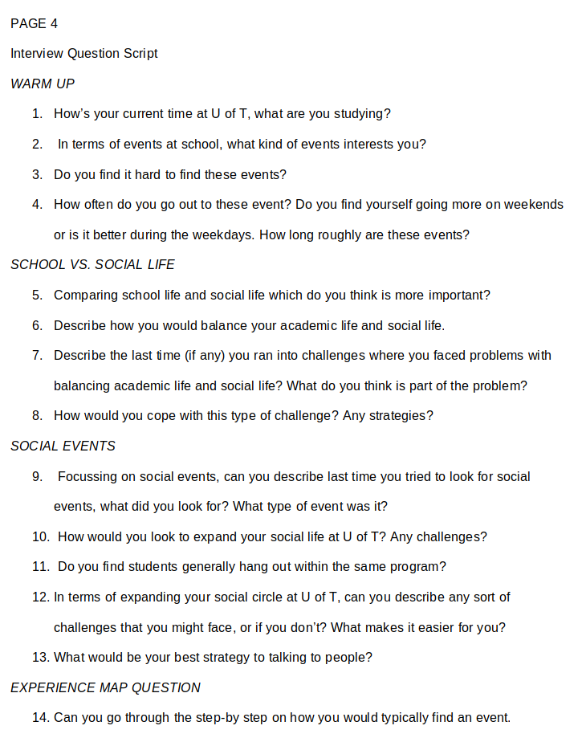

# Introduction

This is Bump! A UX project for CHI 2019 under the course CSC318 at the University of Toronto. The project focused on solving the theme for CHI 2019 "Weaving the Threads of CHI" and delievered over the course of 16 weeks. Working with a team of classmates, we designed and researched a 

## Key Moments

- Generative research survey design
- User interviews
- Low fidelity prototype
- mockup
- paper prototyping
- usability testing
- SUS testing
- "Stakeholder" presentations

# The Problem

CHI 2019 focused on the theme of "Weaving the Threads of CHI". The theme itself revolves around the issue of social connectivity and how can each individual thread of social relationships can be built stronger. In particular, our group looked at various different demographics that struggle with social connectivity like immigrants, elderly, teenagers and post-secondary students. Through secondary research, we ultimately narrowed it down to "How can we enhance the social experience of post-secondary students?" aiming to bridge the gap between the academic and social life of a student.

# Where do we begin?

- We conducted generative research survey's to get a grasp of students currents thoughts on social life around campus
- what did we use? Google Surveys
- We then followed up for people who were available to do interviews

- caveats to survey design?

Creating the experience...

# Ideating and Sketching

We starting to think of designs to a solution...
We had many, ranging from physical to digital solutions

SUS results...

List of the 10 usability heuristics we used to test for
- Visability of system status
- Match between system and real world
- User control and freedom
- Consistency and standards
- Error prevention
- Recognition rather than recall
- Flexibility and efficiency of use
- Aesthetic and minimalist design
- Help users recognize, diagnose, and recover from errors
- Help and documentation

Paper prototyping...
- What was the goal?
- How was it done?
- What we found

# Resources

Project folder can be viewed in the GitHub repository
- [https://github.com/patrickm-tan/CHI](https://github.com/patrickm-tan/CHI)

CHI 2019 Student Competition
- [https://chi2019.acm.org/authors/student-design-competition/](https://chi2019.acm.org/authors/student-design-competition/)