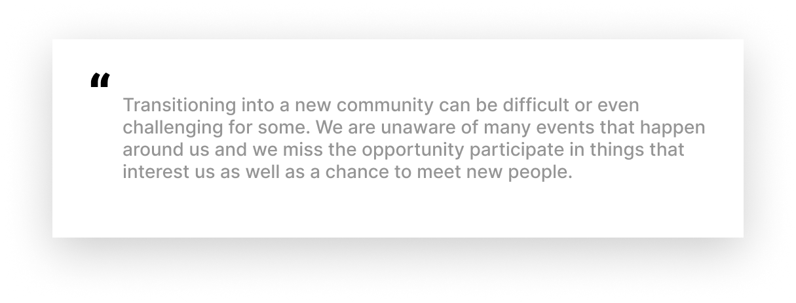
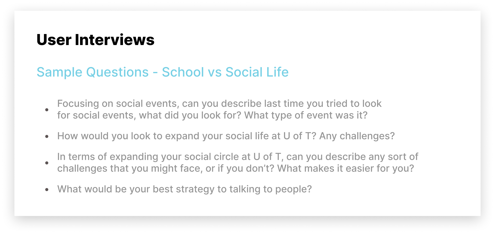
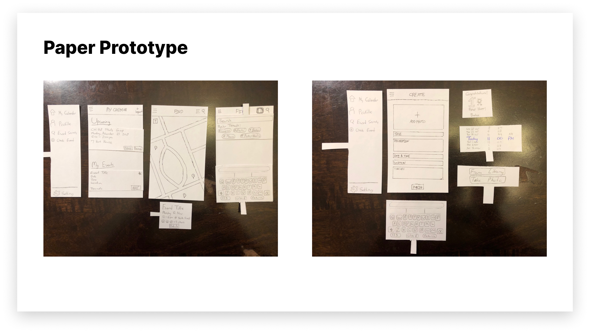
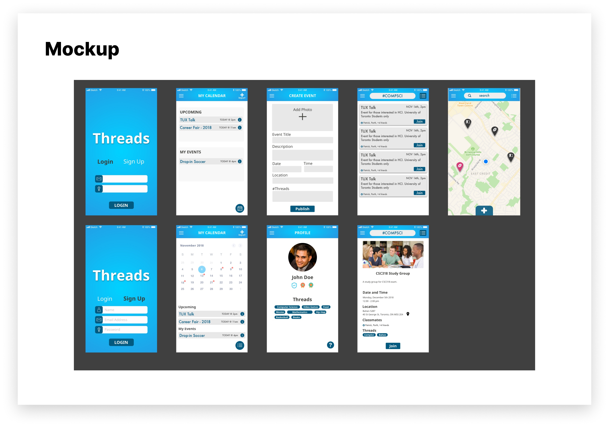

### Introduction

This is Threads! A HCI project for CHI's 2019 student competition under the course CSC318 at the University of Toronto. The project team was made up by myself and 4 other classmates that designed and researched a mobile application for connecting students through community driven events. Throughout 16 weeks we prepared and presented deliverables in preparation for a final stakeholder meeting to pitch our final product.

_note: click on images to view their fullsize!_

### Timeline

Overall, the project took a total of 16 weeks over the course of one semester. It was important to be organized because every week required a deliverable to be presented to the professor that included the research that was done and what is planned for the following week.

### The Problem

The team was tasked to propose a solution to the theme of "Weaving the Threads of CHI". The theme itself revolves around the issue of social connectivity and how can each individual thread of social relationships can be built stronger. With this theme in mind, the group brainstormed different demographics that struggle with social connectivity like immigrants, elderly, teenagers and post-secondary students. 

### Research Statement

After discussing similar experiences amongst the group, we concluded that we would look into the university/college social and academic lifestyle.

We wanted to understand better how post-secondary students think about social and academic balance and how they can improve the social experience throughout their time at university.

What were the goals of the research project?

1. Discover student's mental models on how and why they ...
2. Uncover the different services students are using to connect with other students, and their experience with these services
3. Evaluate how students are currently connecting with other students across the university

### Where do we begin?

For the generative research, we decided on two different methods to fit the timeline:

1. Survey's
2. User Interviews

We first decided to run a survey to reach a wider audience because of its convenience and easy set-up. The goal of the survey was to get an understanding of existing painpoints that students may already have. Our survey design consisted of 5 major categories; demographic, social media usage, social events, clubs & organizations and follow-up. With the help of social media, we were able to get 30 participants to fill out the survey.

We than did user interviews, which meant we had a short 35 minute conversation with each participant. The interview was structured into three main parts; warm-up, social and academic life and social events. The first five minutes focused on introduction and getting to know the student at a basic level (program of study, year, clubs or teams). The next 15 minutes was learning about how students currently balance their social and academic life. This portion of the interview was semi-structured. We started with open-ended questions and decided to probe on any interesting prompts that could be useful to our research. The last 15 minutes was a mix of interviewing and contextual inquiry. We were able to observe them finding & joining a social event and then ask clarifying questions when necessary. This interview allowed us to understand the students mental models and experience of finding social events. Overall, we facilitated 5 interviews.

#### Creating an experience

To further understand the students experiences, we developed an experience map based on the feedback from the formative studies in the previous section. The main goal in creating an experience map was to visualize an end-to-end experience that students go through when attending social events. The map will allow us to see the bigger picture in where we can highlight painpoints in the experience but also enjoyable aspects throughout their experience. 

### Sketching and Testing

With the first stage of the research done, we were able to create a low-fidely prototype of a mobile app. Utilizing the research from the experience map, we highlighted 

Paper prototyping...
- What was the goal?
- How was it done?
- What we found

SUS results...

List of the 10 usability heuristics we used to test for
- Visability of system status
- Match between system and real world
- User control and freedom
- Consistency and standards
- Error prevention
- Recognition rather than recall
- Flexibility and efficiency of use
- Aesthetic and minimalist design
- Help users recognize, diagnose, and recover from errors
- Help and documentation

### Final Design

We designed

### Reflections

__What went well:__
- Creating design decisions based on research
- Paper prototyping
- Outlining our research goals

__Challenges:__
- Obtaining participants for research studies
- Design for scale
- Creating an interactive prototype

### Resources

_Project folder can be viewed in the GitHub repository_

[https://github.com/patrickm-tan/CHI](https://github.com/patrickm-tan/CHI)

_CHI 2019 Student Competition_

[https://chi2019.acm.org/authors/student-design-competition/](https://chi2019.acm.org/authors/student-design-competition/)