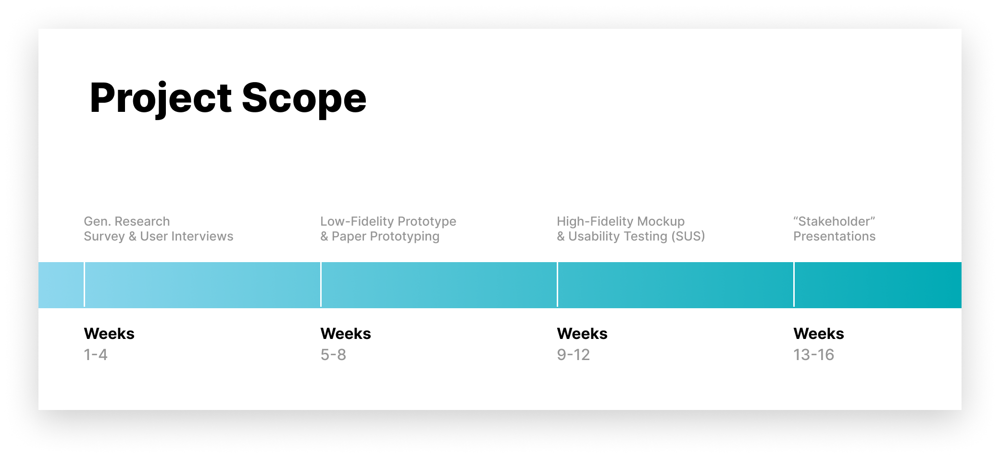
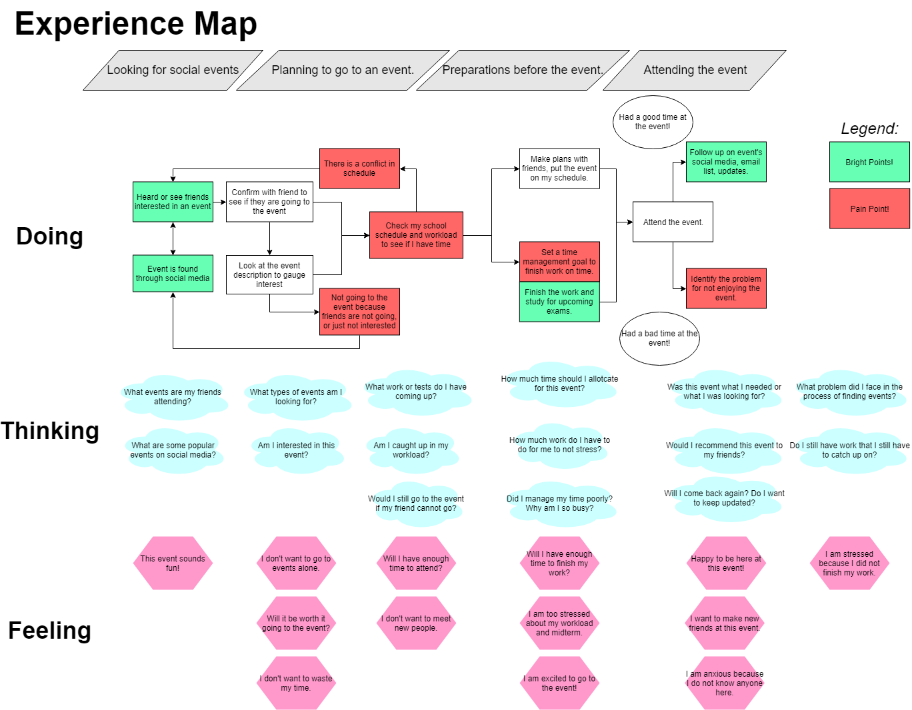

### Introduction

This is Threads! A HCI project for CHI's 2019 student competition under the course CSC318 at the University of Toronto. The project team was made up by myself and 4 other classmates that designed and researched a mobile application for connecting students through community driven events. Throughout 16 weeks we prepared and presented deliverables in preparation for a final stakeholder meeting to pitch our final product.

### Timeline

### The Problem

The team was tasked to propose a solution to the theme of "Weaving the Threads of CHI". The theme itself revolves around the issue of social connectivity and how can each individual thread of social relationships can be built stronger. With this theme in mind, the group brainstormed different demographics that struggle with social connectivity like immigrants, elderly, teenagers and post-secondary students. 

### Research Statement

We wanted to understand better how post-secondary students think about social and academic balance and how they can improve the social experience throughout their time at university.

What were the goals of the research project?

1. Discover student's mental models on how and why they ...
2. Uncover the different services students are using to connect with other students, and their experience with these services
3. Evaluate how students are currently connecting with other students across the university

### Where do we begin?

For the generative research, we decided on two different methods to fit the timeline:

1. Survey's
2. User Interviews

Creating the experience...

### Ideating and Sketching

We starting to think of designs to a solution...
We had many, ranging from physical to digital solutions

SUS results...

List of the 10 usability heuristics we used to test for
- Visability of system status
- Match between system and real world
- User control and freedom
- Consistency and standards
- Error prevention
- Recognition rather than recall
- Flexibility and efficiency of use
- Aesthetic and minimalist design
- Help users recognize, diagnose, and recover from errors
- Help and documentation

Paper prototyping...
- What was the goal?
- How was it done?
- What we found

### Resources

_Project folder can be viewed in the GitHub repository_

[https://github.com/patrickm-tan/CHI](https://github.com/patrickm-tan/CHI)

_CHI 2019 Student Competition_

[https://chi2019.acm.org/authors/student-design-competition/](https://chi2019.acm.org/authors/student-design-competition/)